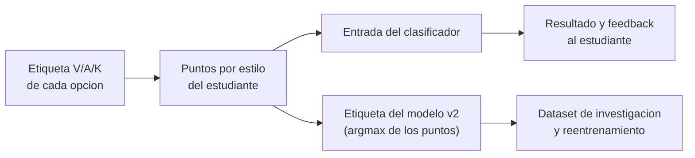
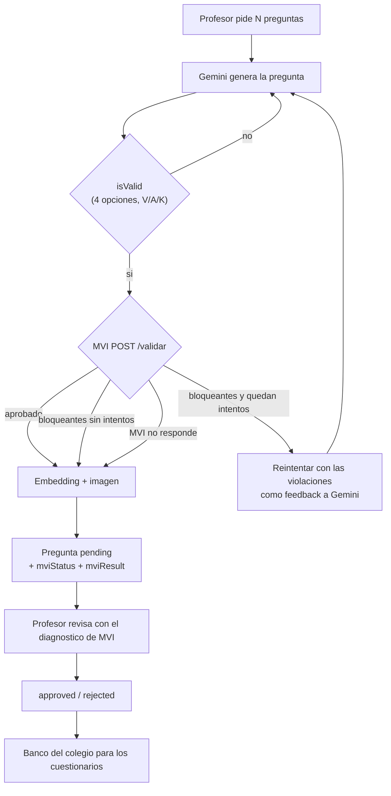

# Integracion de MVI en MathE

Guia de negocio y de flujo: que hace hoy la plataforma MathE, donde interviene el motor de validacion de items (MVI) y como se conecta con el backend. El contrato tecnico completo de MVI esta en el [README](../README.md) y la guia generica de integracion en [GUIA-DE-USO.md](GUIA-DE-USO.md); este documento los aplica al caso concreto de MathE.

Fuentes: pagina "MathE Backend — How the Platform Works Today (Business View)" (verificada contra la rama `release` del backend el 2026-10-01) y el codigo de este repositorio. Lo marcado **[propuesta]** no existe todavia en el backend; lo marcado **[implementado]** ya existe (ver seccion 12).

## 1. La plataforma en una pagina

MathE detecta el estilo de aprendizaje VAK (visual, auditivo, kinestesico) de estudiantes de colegios peruanos de primaria y secundaria.

1. El estudiante responde un cuestionario de **10 preguntas situacionales**: 4 visuales, 3 auditivas y 3 kinestesicas, barajadas.
2. Cada pregunta tiene **4 opciones** y cada opcion vale V, A o K. El estudiante nunca ve que estilo representa cada opcion.
3. Las opciones elegidas suman puntos por estilo. Esos puntos, mas metricas de comportamiento (tiempo, cambios, revisitas), alimentan un clasificador XGBoost en AWS Lambda. Si el clasificador falla, una regla de puntaje simple lo reemplaza.
4. Gemini redacta una retroalimentacion personalizada.
5. Cada cuestionario completado agrega una fila al **dataset de investigacion**. Un profesor puede corregir la etiqueta VAK de un resultado; la fila pasa a `teacher_validated`.

La unidad organizativa es el **colegio**: cada colegio tiene su propio banco de preguntas.

### Ciclo de vida de una pregunta hoy

1. Un profesor aprobado pide de 1 a 10 preguntas de un estilo (`POST /api/questions/generate`). El backend responde 202 y genera en segundo plano.
2. Gemini escribe cada pregunta: situacion hipotetica ("imagina que..."), 4 opciones en primera persona, 2 del estilo pedido y 1 de cada uno de los otros dos.
3. El backend solo comprueba que haya 4 opciones con V, A y K presentes (`isValid`). Luego genera embedding (no se usa) e ilustracion, y guarda la pregunta como `pending`.
4. Un profesor del mismo colegio la aprueba o la rechaza (con motivo). La decision es definitiva.
5. Un cuestionario usa el banco del colegio **solo si** hay suficientes preguntas aprobadas de cada estilo (4 V, 3 A, 3 K). Si no, usa las 15 preguntas del **banco de respaldo** (5 por estilo). Nunca mezcla fuentes.

## 2. Que es MVI y que no es

MVI es un servicio HTTP sin estado que evalua cada item VAK en espanol contra nueve reglas de construccion de items con respaldo bibliografico (Haladyna, Downing y Rodriguez 2002; Moreno, Martinez y Muniz 2015) y una comprobacion del diseno del instrumento. Devuelve, por item, `aprobado` y la lista de violaciones con valor medido, umbral y severidad.

MVI **no** genera preguntas, **no** clasifica estudiantes, **no** guarda nada y **no** reemplaza el juicio del profesor. Es un control de calidad automatico previo a la revision humana.

| Comprobacion | Que exige (catalogo `vak-primaria.json`) |
|---|---|
| R1 `longitud-enunciado` | Enunciado de 30 palabras como maximo |
| R2 `legibilidad-nivel` | Fernandez Huerta entre 70 y 120 (solo enunciados de 20 palabras o mas) |
| R3 `vocabulario-nivel` | Ninguna palabra de contenido fuera del vocabulario del nivel 6 |
| R4 `redaccion-positiva` | Sin doble negacion por clausula (una negacion es advertencia) |
| R5 `longitud-opciones` | 4 opciones de longitud parecida (desviacion maxima 0,35) |
| R6 `homogeneidad-opciones` | Opciones que empiezan con la misma clase de palabra (advertencia) |
| R7 `exclusividad-opciones` | Opciones que no se solapan lexicamente (maximo 0,55) |
| R8 `independencia-banco` | Enunciado distinto del banco y de los items anteriores del lote (Jaccard maximo 0,5) |
| R9 `correspondencia-dimension` | Cada opcion contiene un marcador lexico de su propio estilo |
| `composicion-dimensiones` | Estilo declarado en 2 opciones y uno de cada otro estilo |

## 3. Por que MVI importa para el negocio

La etiqueta V/A/K de cada opcion es el dato del que depende todo lo demas:



Si una opcion dice K pero su texto describe una accion visual, se corrompen **a la vez** la entrada del clasificador y la etiqueta con la que se entrena, y el modelo no tiene forma de detectarlo. R9 y `composicion-dimensiones` comprueban justamente esa correspondencia antes de que la pregunta llegue al banco. MVI es el control de calidad aguas arriba del dataset.

Impactos concretos:

- **Profesor:** recibe cada pregunta pendiente con un diagnostico (que regla falla y que palabra concreta) en lugar de revisarla en blanco. Puede rechazar con el motivo ya redactado.
- **Estudiante:** no cambia nada visible. Recibe preguntas mejor construidas.
- **Investigacion:** las preguntas del banco quedan auditadas con criterios citables. El desacuerdo entre MVI y el profesor (aprobar pese a bloqueantes) es un dato medible.
- **Costo:** validar antes de generar la imagen evita gastar Gemini Image y almacenamiento en preguntas que se van a descartar.

Efecto lateral que hay que vigilar: si MVI filtra demasiado, el colegio tarda mas en reunir 4 V, 3 A y 3 K aprobadas y sus estudiantes siguen en el banco de respaldo.

## 4. Donde interviene MVI

MVI entra en un unico punto: **entre Gemini y la persistencia como `pending`**. El resto del flujo no cambia.



Puntos de contacto, todos desde el backend:

| Momento | Llamada a MVI | Para que |
|---|---|---|
| Inicio de cada lote de generacion | `GET /salud` | Despertar el servicio (Render free tarda unos 50 s en frio) |
| Cada intento de generacion | `POST /validar` con 1 item y el `banco` | Decidir si se acepta, se reintenta o se guarda con diagnostico |
| Arranque del backend o cada hora | `GET /reglas` | Leer marcadores, maximo de palabras y version del catalogo para el prompt |
| Revalidacion manual **[implementado]** | `POST /validar` | Preguntas guardadas como `unavailable` o tras cambiar la version del catalogo |
| Auditoria del banco **[propuesta]** | `POST /banco/verificar` | Detectar sesgo posicional (por ejemplo, K casi siempre en la opcion 4) |

El frontend **nunca** llama a MVI: el token es secreto. Solo muestra lo que el backend guardo.

## 5. Correspondencia de datos

| MathE (backend) | MVI | Nota |
|---|---|---|
| `Question.id` | `items[].id` | Opcional; MVI lo devuelve tal cual |
| `Question.statement` | `items[].enunciado` | Sin normalizar: MVI distingue tildes |
| `Question.vakStyle` (`Visual`, `Auditory`, `Kinesthetic`) | `items[].dimensionDeclarada` (`V`, `A`, `K`) | Traducir |
| `Option.text` | `items[].opciones[].texto` | Conservar el orden guardado |
| `Option.vakValue` (`V`, `A`, `K`) | `items[].opciones[].dimension` | Igual |
| (no existe grado en `Question`) | `items[].nivel` | Siempre `6`: un banco unico calibrado para 6to de primaria y 1ro de secundaria |
| Enunciados `approved` y `pending` del colegio | `banco` | MVI no recuerda nada; se envia en cada peticion |

Ejemplo de peticion:

```json
{
  "items": [{
    "id": "uuid-de-la-pregunta",
    "enunciado": "¿Como prefieres repasar para un examen?",
    "dimensionDeclarada": "V",
    "nivel": 6,
    "opciones": [
      { "texto": "Mirar un mapa con colores", "dimension": "V" },
      { "texto": "Observar un esquema con flechas", "dimension": "V" },
      { "texto": "Escuchar un audio del tema", "dimension": "A" },
      { "texto": "Armar una maqueta con piezas", "dimension": "K" }
    ]
  }],
  "banco": ["enunciado ya existente 1", "enunciado ya existente 2"]
}
```

`aprobado` es `true` si y solo si no hay violaciones `bloqueante`. Las `advertencia` no rechazan.

## 6. Politica de resultados recomendada [implementado]

| Situacion | Que hace el backend | `mviStatus` |
|---|---|---|
| MVI aprueba | Sigue el flujo normal | `passed` |
| MVI rechaza y quedan intentos | Regenera con los `mensaje` bloqueantes como feedback a Gemini | — |
| MVI rechaza en todos los intentos | Guarda el intento con menos bloqueantes como `pending` | `failed` |
| MVI caido o timeout | Guarda como `pending` sin diagnostico; se revalida despues | `unavailable` |
| Integracion apagada | No llama a MVI | `skipped` |

Modo configurable `MVI_MODE`:

- `off`: no se llama a MVI.
- `advisory` (inicio recomendado): se valida, se reintenta y se guarda siempre; el profesor decide.
- `gate`: si todos los intentos fallan, la pregunta no se guarda y el profesor recibe `question_failed`. Activarlo solo cuando la tasa de aprobacion sea aceptable.

Aprobar una pregunta con bloqueantes no se impide: se advierte en la interfaz y se marca `approvedOverMvi = true`. El profesor sigue siendo el juez final.

## 7. Conflicto actual: el prompt de Gemini contra el catalogo

Si se conecta MVI sin tocar el prompt, la tasa de aprobacion sera muy baja:

| Regla | Que exige MVI | Que pide hoy el prompt | Efecto |
|---|---|---|---|
| R9 | Un marcador exacto de su estilo en cada opcion ("escuchar", "imagenes", "maqueta") | Prohibe "ver", "escuchar", "tocar", "leer", "dibujar" | Rechazo masivo |
| R1 | Enunciado de 30 palabras como maximo | Escenarios narrativos "imagina que..." (los generados por IA del banco aprobado tienen de 36 a 78 palabras) | Rechazo masivo |
| R3 | Ninguna palabra fuera de las 1149 del nivel 6 | Vocabulario libre, 15 temas variados | Rechazo frecuente |
| Nivel | 6to de primaria y 1ro de secundaria | "primaria y secundaria" en general | Poblacion desalineada |

La prohibicion del prompt busca que el estudiante no adivine el estilo de cada opcion. R9 busca que el estilo sea verificable en el texto. La salida recomendada es hibrida: seguir prohibiendo los verbos genericos ("ver", "tocar", "hacer", que no son marcadores) y exigir marcadores concretos del catalogo, leidos de `GET /reglas`. Ademas, limitar el enunciado a 30 palabras, pedir opciones de longitud parecida que empiecen igual, evitar negaciones y fijar el publico en 6to y 1ro. Es una decision de investigacion: debe tomarla el responsable del instrumento.

## 8. Cambios en el backend [implementado]

Siguen la arquitectura limpia del backend (puertos y adaptadores, DI manual en las rutas) y el patron del adaptador del clasificador Lambda.

1. **Configuracion:** `MVI_URL`, `MVI_TOKEN`, `MVI_TIMEOUT_MS` (15000), `MVI_WAKEUP_TIMEOUT_MS` (60000), `MVI_MODE` (`advisory`), `MVI_NIVEL` (6).
2. **Puerto de dominio:** `ItemValidatorAdapter` con `validate(items, banco)` y `wakeUp()`.
3. **Adaptador:** cliente HTTP con timeout. Reintenta solo ante 429 o 503. Un 400 es un error de mapeo propio y no se reintenta. Un 401 indica token mal configurado.
4. **Caso de uso de generacion:** validar despues de `isValid` y antes del embedding y la imagen; bucle de feedback; guardar el mejor intento.
5. **Banco para R8:** cargar una vez por lote los enunciados `approved` y `pending` del colegio y agregar los nuevos del mismo lote a medida que se guardan.
6. **Persistencia:** columnas `mviStatus`, `mviResult` (JSON), `mviCatalogVersion`, `mviValidatedAt` y `approvedOverMvi` en `Question`.
7. **Endpoints:** exponer el diagnostico en las respuestas del profesor (nunca en las del estudiante) y agregar `POST /api/questions/:id/validate` para revalidar.
8. **Exportacion de investigacion:** incluir `mviStatus` y `approvedOverMvi` en el CSV de preguntas para medir el acuerdo entre MVI y el profesor.

En el frontend: insignia de MVI en la lista de pendientes, panel de violaciones en la pantalla de revision (bloqueantes primero), confirmacion extra al aprobar con bloqueantes y motivo de rechazo prellenado.

## 9. Lo que la integracion no cambia

- El flujo del estudiante, la composicion 4/3/3 del cuestionario y el banco de respaldo.
- El clasificador, la regla de respaldo y el feedback de Gemini.
- La correccion de etiquetas del profesor sobre los resultados.
- La autoridad del profesor: MVI informa, el profesor decide.

## 10. Riesgos

| Riesgo | Mitigacion |
|---|---|
| Tasa de aprobacion baja por R3 y R9 | Prompt alineado, bucle de feedback, modo `advisory` al inicio, ampliar el vocabulario con preguntas aprobadas en el piloto |
| Colegios atrapados en el banco de respaldo | Medir cuantas preguntas aprobadas por estilo tiene cada colegio antes de pasar a `gate` |
| Mas llamadas a Gemini por los reintentos | Validar antes de la imagen y limitar los intentos |
| Arranque en frio de Render | `GET /salud` al inicio de cada lote, o plan pagado durante el piloto |
| R8 solo detecta duplicacion lexica | Complementar con similitud de los embeddings que ya se guardan |
| Cambio de catalogo cambia los resultados | Guardar `mviCatalogVersion` y revalidar al cambiar de version |
| Vocabulario derivado de solo 44 items | Declararlo como limitacion y ampliarlo con datos del piloto |
| Fuga del token | Solo en el backend; nunca en el frontend ni en los registros |

## 11. Puesta en marcha

1. Desplegar MVI en Render (New > Blueprint con `render.yaml`) y copiar `MVI_TOKEN` al backend.
2. Decidir la alineacion del prompt (seccion 7) y medir la tasa de aprobacion con `npm run probar -- <items.json> --catalogo catalogos/vak-primaria.json --todas` sobre 50 a 100 preguntas generadas, antes y despues del cambio.
3. Implementar los cambios del backend en modo `advisory`.
4. Mostrar el diagnostico al profesor.
5. Pasar a `gate` solo con datos de aprobacion y de cobertura del banco por colegio.

## 12. Estado de la implementacion (backend)

Implementado en la rama `feat/mvi-integration`:

- **Configuracion:** `MVI_URL`, `MVI_TOKEN`, `MVI_TIMEOUT_MS`, `MVI_WAKEUP_TIMEOUT_MS`, `MVI_MODE` (`off`, `advisory`, `gate`) y `MVI_NIVEL`. Con `MVI_MODE=off` o sin `MVI_URL` la integracion queda apagada (`mviStatus = skipped`).
- **Puerto y adaptador:** `ItemValidatorAdapter` (`validate`, `wakeUp`, `getCatalog`) y su cliente HTTP con timeout y reintento solo ante 429 o 503.
- **Estados persistidos:** `mviStatus` (`passed`, `failed`, `unavailable`, `skipped`), `mviResult`, `mviCatalogVersion` y `mviValidatedAt` en `Question`.
- **Prompt hibrido:** sigue prohibiendo los verbos genericos, exige marcadores del catalogo, enunciado de 30 palabras como maximo y publico de 6to de primaria y 1ro de secundaria.
- **Bucle de feedback:** las violaciones bloqueantes vuelven a Gemini como retroalimentacion; si se agotan los intentos se guarda el mejor intento (`advisory`) o se descarta la pregunta (`gate`).
- **Banco para R8:** enunciados `approved` y `pending` del colegio, cargados una vez por lote y ampliados con los nuevos del mismo lote.
- **`approvedOverMvi`:** `PATCH /api/questions/:id/approve` nunca se bloquea y marca `approvedOverMvi = true` si la pregunta estaba en `failed`.
- **`POST /api/questions/:id/validate`:** revalida una pregunta guardada (admin, o profesor del mismo colegio) con limite de 30 peticiones cada 10 minutos. Los campos MVI se devuelven solo a profesor y admin; el estudiante nunca los recibe.
- **CSV de investigacion:** `preguntas.csv` incluye `mviStatus`, `approvedOverMvi`, `mviCatalogVersion` y `mviValidatedAt`.

Sigue como propuesta:

- **`POST /banco/verificar`:** auditoria del banco para detectar sesgo posicional.
- **Interfaz del frontend:** insignia, panel de violaciones, confirmacion extra al aprobar con bloqueantes y motivo de rechazo prellenado (los campos ya estan documentados en `FRONTEND_INTEGRATION.md`).
- **Decision de pasar a `gate`:** depende de la tasa de aprobacion y de la cobertura del banco por colegio (seccion 11).
